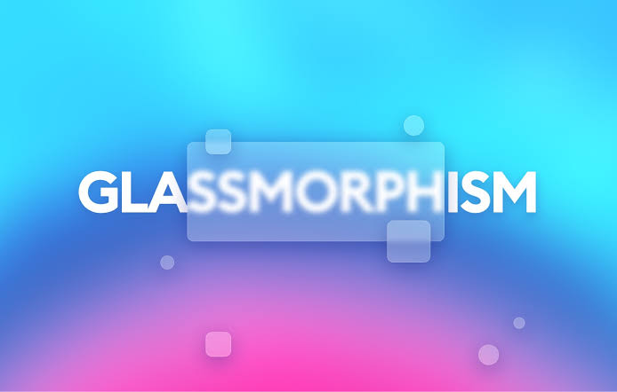

# glassCSS



A Glassmorphism CSS code generator tool

**Generator @** [https://hind-sagar-biswas.github.io/glassCSS/](https://hind-sagar-biswas.github.io/glassCSS/)

## What is Glassmorphism

Glassmorphism is a unified name for the popular Frosted Glass aesthetic. It has many names depending on the company using it, so we wanted to create a common ground for designers and developers to find related resources easier and faster.

The effect is based on background blur with transparency, and uses stacked layers to show the depth and context of the interface.

## CSS code

General CSS code for glassmorphism

```css
background: rgba( 225, 225, 225, 0.3 );
box-shadow: 0 8px 32px 0 rgba( 31, 38, 135, 0.30 );
backdrop-filter: blur( 4px );
-webkit-backdrop-filter: blur( 4px );
border-radius: 10px;
border: 1px solid rgba( 255, 255, 255, 0.18 );
```

Use the above code to any `element` to give it a glass morphic effect.

## License

This code has been licensed under `GNU AGPLv3` open source copyleft license. 
